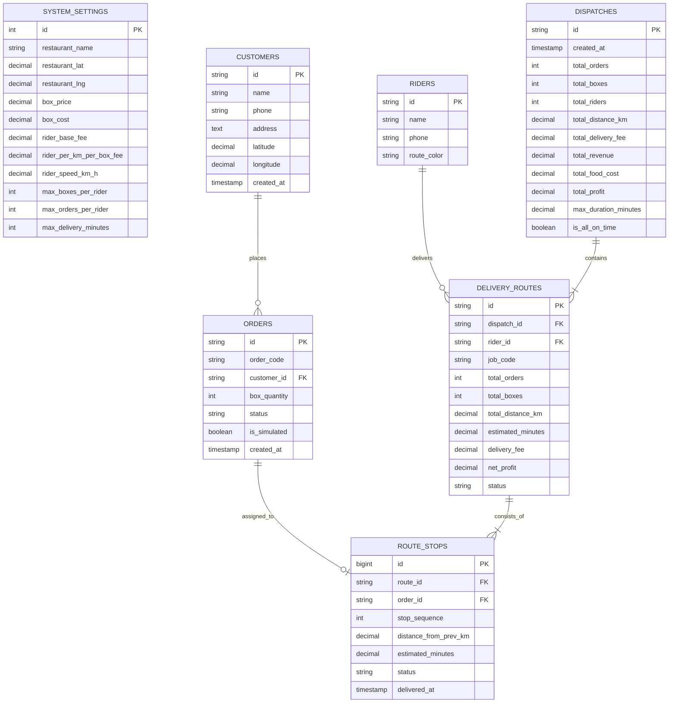

# 🗄️ Database Schema & API Architecture Design
> สำหรับระบบ **Route Optimization & Cost Analysis Delivery System (PaTim - ส่งด่วนมื้อเที่ยง)**

เอกสารนี้ระบุโครงสร้างฐานข้อมูลแบบ **Relational Database (PostgreSQL / MySQL / SQLite)** ที่ปรับปรุงให้ **กระชับ เก็บเฉพาะ Attribute ที่จำเป็นจริง** ตามข้อกำหนดของโจทย์ใน [project_requirements.md](file:///Users/pattama/Documents/1_2569_AdvWeb/pa_tim/Plan/project_requirements.md) และคู่มือของสมาชิกทั้ง 4 คน

---

## 1. รายชื่อตารางในระบบ (Database Tables Overview)

```text
├── 1. system_settings   (ตารางค่าคงที่ร้านค้าและเงื่อนไขคำนวณเงิน/เวลา)
├── 2. customers         (ตารางข้อมูลลูกค้าและพิกัดสำหรับปักหมุด Leaflet)
├── 3. riders            (ตารางข้อมูลไรเดอร์และสีประจำตัวสำหรับวาดเส้นทาง)
├── 4. orders            (ตารางรายการออเดอร์ 1-3 กล่อง และสถานะ Mock)
├── 5. dispatches        (ตารางสรุปรอบจัดส่งและแดชบอร์ดกำไร/เวลา)
├── 6. delivery_routes   (ตารางสายส่งรายคน / Job Sheet ประจำรอบ)
└── 7. route_stops       (ตารางลำดับจุดส่ง 1, 2, 3 ของไรเดอร์แต่ละคน)
```

---

## 2. รายละเอียดโครงสร้างตาราง (Cleaned Table Schemas)

### 1) ตาราง `system_settings` (ตั้งค่าระบบและต้นทุนร้าน)
> เก็บค่าคงที่และพารามิเตอร์สำหรับคำนวณเส้นทางและคำนวณกำไร/เวลา (ใช้แถวเดียว `id = 1`)

| Column Name    | Data Type      |  Key   | Description / ข้อกำหนดโจทย์                          |
| :------------- | :------------- | :----: | :--------------------------------------------------- |
| `id`           | INT            | **PK** | รหัสตั้งค่า (ค่าคงที่ `1`)                           |
| `name`         | VARCHAR(100)   |        | ชื่อร้าน (เช่น 'ร้านข้าวกล่อง PaTim')                |
| `latitude`     | DECIMAL(10, 7) |        | ละติจูดร้านค้า (ม.มหาสารคาม: `16.2468256`)           |
| `longitude`    | DECIMAL(10, 7) |        | ลองจิจูดร้านค้า (ม.มหาสารคาม: `103.2520721`)         |
| `box_price`    | DECIMAL(10, 2) |        | ราคาขายต่อกล่อง (`65.00` บาท)                        |
| `box_cost`     | DECIMAL(10, 2) |        | ต้นทุนอาหารต่อกล่อง (`40.00` บาท)                    |
| `rider_base`   | DECIMAL(10, 2) |        | ค่าเรียกรถขั้นต่ำต่อรอบ (`15.00` บาท/คน)             |
| `rider_km_box` | DECIMAL(10, 2) |        | ค่าส่งผันแปร (`2.00` บาท/กม./กล่อง)                  |
| `rider_speed`  | DECIMAL(5, 2)  |        | ความเร็วเฉลี่ยไรเดอร์ (`30.00` กม./ชม. = 2 นาที/กม.) |
| `max_orders`   | INT            |        | ส่งสูงสุดต่อคน (`3` ออเดอร์/จุด)                     |
| `max_minutes`  | INT            |        | กรอบเวลาจัดส่งสูงสุด (`60` นาที: 11:30 - 12:30 น.)   |

---

### 2) ตาราง `customers` (ข้อมูลลูกค้าและพิกัด)
> สำหรับสมาชิกลำดับที่ 1 ใช้บันทึก/แก้ไขข้อมูลลูกค้า และปักหมุดบนแผนที่ Leaflet (รัศมี 3 กม.)

| Column Name  | Data Type      |  Key   | Description / การใช้งาน      |
| :----------- | :------------- | :----: | :--------------------------- |
| `id`         | VARCHAR(50)    | **PK** | รหัสลูกค้า (เช่น 'CUST-001') |
| `name`       | VARCHAR(150)   |        | ชื่อ-นามสกุลลูกค้า           |
| `phone`      | VARCHAR(20)    |        | เบอร์โทรศัพท์ติดต่อ          |
| `address`    | TEXT           |        | ที่อยู่จัดส่ง / หอพัก / คณะ  |
| `latitude`   | DECIMAL(10, 7) |        | ละติจูดพิกัดจัดส่ง           |
| `longitude`  | DECIMAL(10, 7) |        | ลองจิจูดพิกัดจัดส่ง          |
| `created_at` | TIMESTAMP      |        | วันที่บันทึกข้อมูล           |

---

### 3) ตาราง `riders` (ข้อมูลไรเดอร์และสีประจำเส้นทาง)
> เก็บข้อมูลไรเดอร์ พร้อมรหัสสีสำหรับวาดเส้นทางแยกสีบนแผนที่ของร้านค้า

| Column Name | Data Type    |  Key   | Description / การใช้งาน                                      |
| :---------- | :----------- | :----: | :----------------------------------------------------------- |
| `id`        | VARCHAR(50)  | **PK** | รหัสไรเดอร์ (เช่น 'RD-01')                                   |
| `name`      | VARCHAR(150) |        | ชื่อไรเดอร์ (เช่น 'คุณสมชาย ใจดี')                           |
| `phone`     | VARCHAR(20)  |        | เบอร์โทรศัพท์ติดต่อ                                          |
| `color`     | VARCHAR(20)  |        | สีประจำตัววาดเส้น Map (เช่น `#EF4444`, `#10B981`, `#3B82F6`) |

---

### 4) ตาราง `orders` (รายการสั่งซื้อข้าวกล่อง)
> สำหรับสมาชิกลำดับที่ 2 จัดการออเดอร์ (1–3 กล่อง) และสร้าง/ล้าง Mock Simulation 20–30 รายการ

| Column Name    | Data Type   |  Key   | Description / การใช้งาน                                 |
| :------------- | :---------- | :----: | :------------------------------------------------------ |
| `id`           | VARCHAR(50) | **PK** | รหัสออเดอร์ (เช่น 'ORD-001')                            |
| `customer_id`  | VARCHAR(50) | **FK** | อ้างอิง `customers.id`                                  |
| `box_quantity` | INT         |        | จำนวนกล่อง (เงื่อนไข: **1 - 3 กล่อง**)                  |
| `status`       | VARCHAR(20) |        | สถานะ (`pending`, `assigned`, `delivered`, `cancelled`) |
| `created_at`   | TIMESTAMP   |        | วันที่และเวลาที่สั่งซื้อ (ช่วง 10:00 น.)                |
| `menu`         | VARCHAR(50) |        | ชื่อเมนูอาหาร                                           |

---

### 5) ตาราง `dispatches` (สรุปรอบจัดส่ง & Real-time Financial Dashboard)
> สำหรับสมาชิกลำดับที่ 3 เก็บผลสรุปการกดจัดเส้นทาง (11:30 น.) เพื่อแสดงสถิติและผลกำไรภาพรวม

| Column Name         | Data Type      |  Key   | Description / การใช้งาน                                                     |
| :------------------ | :------------- | :----: | :-------------------------------------------------------------------------- |
| `id`                | VARCHAR(50)    | **PK** | รหัสรอบจัดส่ง (เช่น 'DISP-20261004-01')                                     |
| `created_at`        | TIMESTAMP      |        | เวลาที่กดคำนวณจัดส่ง (11:30 น.)                                             |
| `total_orders`      | INT            |        | จำนวนออเดอร์ทั้งหมดในรอบนี้                                                 |
| `total_boxes`       | INT            |        | จำนวนกล่องรวมทั้งหมด                                                        |
| `total_riders`      | INT            |        | จำนวนไรเดอร์ที่ต้องเรียกใช้                                                 |
| `total_distance_km` | DECIMAL(10, 2) |        | ระยะทางรวมทุกสายส่ง (กม.)                                                   |
| `total_rider_price` | DECIMAL(10, 2) |        | ค่าจ้างไรเดอร์รวม: $\sum [15 + (\text{dist} \times 2 \times \text{boxes})]$ |
| `total_revenue`     | DECIMAL(10, 2) |        | รายรับรวม: $\text{total\_boxes} \times 65$                                  |
| `total_food_cost`   | DECIMAL(10, 2) |        | ต้นทุนอาหารรวม: $\text{total\_boxes} \times 40$                             |
| `total_profit`      | DECIMAL(10, 2) |        | กำไรสุทธิ: $(\text{total\_boxes} \times 25) - \text{total\_delivery\_fee}$  |
| `max_minutes`       | DECIMAL(5, 2)  |        | เวลาของสายที่วิ่งนานที่สุด (นาที)                                           |
| `all_on_time`       | BOOLEAN        |        | ทุกสายส่งเสร็จภายใน 60 นาที (ก่อน 12:30 น.) หรือไม่                         |


---

### 6) ตาราง `delivery_routes` (สายส่งประจำไรเดอร์แต่ละคน / Job Batch)
> เก็บข้อมูลสายส่งที่จัดสรรให้ไรเดอร์แต่ละคน สำหรับแสดงสรุปงานและให้ไรเดอร์ค้นหา Job Code

| Column Name         | Data Type      |    Key    | Description / การใช้งาน                                                 |
| :------------------ | :------------- | :-------: | :---------------------------------------------------------------------- |
| `id`                | VARCHAR(50)    |  **PK**   | รหัสสายส่ง (เช่น 'ROUTE-01')                                            |
| `dispatch_id`       | VARCHAR(50)    |  **FK**   | อ้างอิง `dispatches.id`                                                 |
| `rider_id`          | VARCHAR(50)    |  **FK**   | อ้างอิง `riders.id`                                                     |
| `job_code`          | VARCHAR(50)    | **INDEX** | เลขใบงานสำหรับไรเดอร์ค้นหา (เช่น 'JOB-MSU-01')                          |
| `total_orders`      | INT            |           | จำนวนออเดอร์ในสายนี้ (**$\le 3$ ออเดอร์**)                              |
| `total_boxes`       | INT            |           | จำนวนกล่องที่ต้องบรรทุก (**$\le 10$ กล่อง**)                            |
| `total_distance_km` | DECIMAL(10, 2) |           | ระยะทางรวมของสายนี้ (กม.)                                               |
| `time_delivery`     | DECIMAL(5, 2)  |           | เวลาที่ใช้จัดส่งทั้งหมด (**$\le 60$ นาที**)                             |
| `delivery_price`    | DECIMAL(10, 2) |           | ค่าจ้างของสายนี้: $15 + (\text{distance} \times 2 \times \text{boxes})$ |
| `net_profit`        | DECIMAL(10, 2) |           | กำไรสุทธิของสายนี้: $(\text{boxes} \times 25) - \text{delivery\_fee}$   |
| `status`            | VARCHAR(20)    |           | สถานะสายส่ง (`pending`, `delivering`, `completed`)                      |

---

### 7) ตาราง `route_stops` (ลำดับจุดแวะส่งของไรเดอร์)
> สำหรับสมาชิกลำดับที่ 4 ใช้แสดงลำดับการส่ง `1 -> 2 -> 3`, เปิดนำทาง Google Maps และกดบันทึกส่งสำเร็จ

| Column Name       | Data Type             |  Key   | Description / การใช้งาน                                       |
| :---------------- | :-------------------- | :----: | :------------------------------------------------------------ |
| `id`              | BIGINT / INT AUTO_INC | **PK** | รหัสจุดส่ง                                                    |
| `route_id`        | VARCHAR(50)           | **FK** | อ้างอิง `delivery_routes.id`                                  |
| `order_id`        | VARCHAR(50)           | **FK** | อ้างอิง `orders.id` (ดึงชื่อลูกค้า, เบอร์, พิกัด, กล่อง)      |
| `stop_number`     | INT                   |        | ลำดับการส่ง (**1, 2, 3**)                                     |
| `distance_before` | DECIMAL(10, 2)        |        | ระยะทางจากจุดก่อนหน้า (กม.)                                   |
| `total_time`      | DECIMAL(5, 2)         |        | เวลารวมตั้งแต่เริ่มส่งถึงจุดนี้ (นาที)                        |
| `status`          | VARCHAR(20)           |        | สถานะจุดส่ง (`pending`, `in_progress`, `delivered`, `failed`) |
| `delivered_at`    | TIMESTAMP             |        | เวลาที่ไรเดอร์กดส่งสำเร็จ                                     |

---

## 3. ผังความสัมพันธ์ (Entity Relationship Diagram)



---

## 4. ตารางเปรียบเทียบสิ่งที่ปรับลด (Optimization Summary)

| ตาราง | ฟิลด์เดิมที่ตัดออก | เหตุผลตาม Business Requirements |
| :--- | :--- | :--- |
| `system_settings` | `service_time_per_stop_min`, `restaurant_address`, `start_delivery_time`, `target_delivery_time` | รวมเป็น `max_delivery_minutes = 60` และคำนวณเวลาจากความเร็ว $30\text{ km/h}$ ตามโจทย์ |
| `customers` | `notes` | รวมรายละเอียดทั้งหมดไว้ใน `address` ไม่ต้องเก็บฟิลด์ซ้ำซ้อน |
| `riders` | `vehicle`, `avatar`, `is_active` | ไรเดอร์ทุกคนใช้มอเตอร์ไซค์เหมือนกัน และเก็บเฉพาะสี `route_color` เพื่อวาดเส้นทางตามโจทย์ |
| `orders` | `menu`, `order_time`, `notes` | ร้านขายข้าวกล่องเมนูเดียวกล่องละ 65 บาท และใช้ `created_at` บันทึกเวลาแทน |
| `dispatches` | `strategy`, `variation`, `profit_margin_percent` | อัลกอริทึมเน้นเส้นทางสั้นและประหยัดที่สุดตามโจทย์ ส่วน Margin คำนวณใน Frontend ได้ |
| `delivery_routes` | `completed_before_deadline`, `revenue`, `food_cost`, `finish_time`, `full_directions_url`, `road_geometry` | ตัดฟิลด์คำนวณซ้ำซ้อนออก แผนที่วาด Polyline จากพิกัด Lat/Lng ใน Leaflet โดยตรง |
| `route_stops` | `type`, `boxes_remaining`, `arrival_time`, `address`, `lat`, `lng`, `boxes` | ข้อมูลลูกค้าดึงผ่าน FK `orders` $\rightarrow$ `customers` โดยตรง ไม่เก็บข้อมูลซ้ำซ้อน |

---

## 5. การเชื่อมโยงกับ RESTful API Endpoints

| Method | Endpoint | ตารางที่เกี่ยวข้อง | วัตถุประสงค์ตามบทบาทสมาชิก |
| :--- | :--- | :--- | :--- |
| `GET / PUT` | `/api/settings` | `system_settings` | ดึง / บันทึกการตั้งค่าร้านและต้นทุน |
| `GET / POST / PUT / DELETE` | `/api/customers` | `customers` | จัดการข้อมูลลูกค้าและพิกัด (สมาชิกคนที่ 1) |
| `GET / POST / DELETE` | `/api/orders` | `orders`, `customers` | จัดการคำสั่งซื้อ 1-3 กล่อง (สมาชิกคนที่ 2) |
| `POST` | `/api/orders/simulate` | `orders`, `customers` | สุ่มจำลองออเดอร์ 20-30 รายการ (สมาชิกคนที่ 2) |
| `DELETE` | `/api/orders/simulated` | `orders` | ล้างเฉพาะออเดอร์จำลอง (`is_simulated = true`) |
| `GET` | `/api/riders` | `riders` | ดึงรายชื่อไรเดอร์และรหัสสีสำหรับวาดแผนที่ |
| `POST` | `/api/dispatches/optimize` | `orders`, `riders` $\rightarrow$ `dispatches`, `delivery_routes`, `route_stops` | รัน VRP Algorithm จัดสายส่งและคำนวณกำไร (สมาชิกคนที่ 3) |
| `GET` | `/api/dispatches/latest` | `dispatches`, `delivery_routes`, `route_stops` | ดึงผลสรุปรอบจัดส่งล่าสุดแสดงบน Dashboard (สมาชิกคนที่ 3) |
| `GET` | `/api/rider/jobs/:jobCode` | `delivery_routes`, `route_stops`, `orders`, `customers` | ไรเดอร์ค้นหา Job Code ดูลำดับจุดส่ง 1, 2, 3 (สมาชิกคนที่ 4) |
| `PATCH` | `/api/rider/jobs/:jobCode/stops/:stopId` | `route_stops`, `orders`, `delivery_routes` | ไรเดอร์กดอัปเดตสถานะส่งสำเร็จ (สมาชิกคนที่ 4) |
