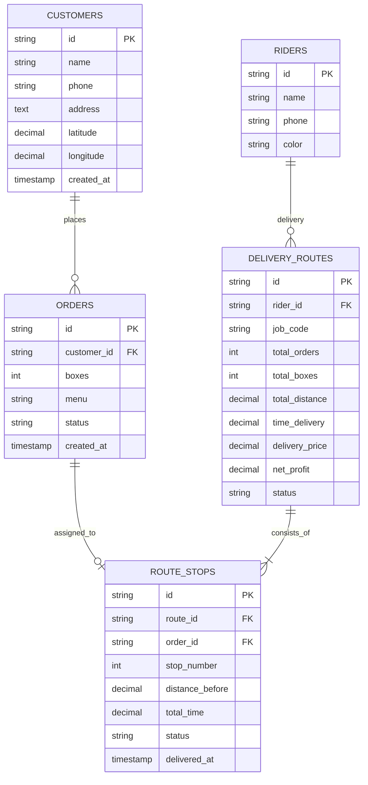

# 🗄️ โครงสร้างข้อมูลสำหรับเชื่อมต่อ API (Data Schema Reference)
> อ้างอิงโครงสร้างข้อมูลที่ส่งกลับจาก API และฐานข้อมูล 5 ตารางของระบบ **PaTim (ส่งด่วนมื้อเที่ยง)**  
> *(ฐานข้อมูลและระบบ Backend API ฝั่ง Server พัฒนาเสร็จสิ้นแล้ว เอกสารนี้มีไว้เพื่อดูฟิลด์และชนิดข้อมูลในการเชื่อมต่อ API ฝั่ง Frontend)*

---

## 1. ตารางข้อมูลและฟิลด์ที่ส่งกลับจาก API (Data Models)

---

### 1) ข้อมูลลูกค้า (`customers`)
> ใช้งานในหน้า **Customer Management** (สมาชิกคนที่ 1) และแสดงข้อมูลในออเดอร์

| Field Name | Type | Description |
| :--- | :--- | :--- |
| `id` | `string` | รหัสลูกค้า (เช่น `'CUST-001'`) |
| `name` | `string` | ชื่อ-นามสกุลลูกค้า |
| `phone` | `string` | เบอร์โทรศัพท์ติดต่อ |
| `address` | `string` | ที่อยู่จัดส่ง / หอพัก / คณะ |
| `latitude` | `number` | ละติจูดพิกัดจัดส่ง |
| `longitude` | `number` | ลองจิจูดพิกัดจัดส่ง |
| `created_at` | `string` | วันเวลาที่บันทึกข้อมูล |

---

### 2) ข้อมูลไรเดอร์ (`riders`)
> ใช้งานในหน้า **Route Dashboard** (สมาชิกคนที่ 3) สำหรับดึงสีประจำตัววาดแผนที่

| Field Name | Type | Description |
| :--- | :--- | :--- |
| `id` | `string` | รหัสไรเดอร์ (เช่น `'RD-01'`) |
| `name` | `string` | ชื่อ-นามสกุลไรเดอร์ |
| `phone` | `string` | เบอร์โทรศัพท์ติดต่อ |
| `color` | `string` | รหัสสีประจำตัวสำหรับวาดเส้น Polyline บนแผนที่ (เช่น `'#EF4444'`) |

---

### 3) ข้อมูลรายการสั่งซื้อ (`orders`)
> ใช้งานในหน้า **Order Management** (สมาชิกคนที่ 2) และนำไปคำนวณเส้นทาง (สมาชิกคนที่ 3)

| Field Name | Type | Description |
| :--- | :--- | :--- |
| `id` | `string` | รหัสออเดอร์ (เช่น `'ORD-001'`) |
| `customer_id` | `string` | รหัสลูกค้าที่สั่งซื้อ |
| `boxes` | `number` | จำนวนกล่อง (**1 - 3 กล่อง**) |
| `menu` | `string` | เมนูอาหาร (เช่น `'ข้าวกะเพราหมูสับไข่เค็ม'`) |
| `status` | `string` | สถานะ (`'pending'`, `'assigned'`, `'delivering'`, `'delivered'`, `'cancelled'`) |
| `created_at` | `string` | วันเวลาสั่งซื้อ (ช่วง 10:00 น.) |

---

### 4) ข้อมูลสายส่งของไรเดอร์ (`delivery_routes`)
> ใช้งานในหน้า **Route Dashboard** (สมาชิกคนที่ 3) และ **Rider Portal** (สมาชิกคนที่ 4)

| Field Name | Type | Description |
| :--- | :--- | :--- |
| `id` | `string` | รหัสสายส่ง (เช่น `'ROUTE-01'`) |
| `rider_id` | `string` | รหัสไรเดอร์ผู้รับผิดชอบ |
| `job_code` | `string` | รหัสใบงานสำหรับไรเดอร์ค้นหา (เช่น `'JOB-MSU-01'`) |
| `total_orders` | `number` | จำนวนออเดอร์ในสายนี้ (**$\le 3$ ออเดอร์**) |
| `total_boxes` | `number` | จำนวนกล่องรวมที่บรรทุก (**$\le 10$ กล่อง**) |
| `total_distance` | `number` | ระยะทางรวมของสายนี้ (กิโลเมตร) |
| `time_delivery` | `number` | เวลาที่ใช้จัดส่งทั้งหมด (**$\le 60$ นาที**) |
| `delivery_price` | `number` | ค่าขนส่งของสายนี้: $15 + (\text{total\_distance} \times 2 \times \text{total\_boxes})$ |
| `net_profit` | `number` | กำไรสุทธิของสายนี้: $(\text{total\_boxes} \times 25) - \text{delivery\_price}$ |
| `status` | `string` | สถานะสายส่ง (`'assigned'`, `'in_progress'`, `'completed'`) |

---

### 5) ข้อมูลลำดับจุดส่ง (`route_stops`)
> ใช้งานในหน้า **Rider Portal** (สมาชิกคนที่ 4) สำหรับดูจุดส่ง 1, 2, 3 นำทาง และอัปเดตสถานะ

| Field Name | Type | Description |
| :--- | :--- | :--- |
| `id` | `string` | รหัสจุดส่ง (เช่น `'STOP-001'`) |
| `route_id` | `string` | รหัสสายส่งที่สังกัด |
| `order_id` | `string` | รหัสออเดอร์ที่ต้องส่ง |
| `stop_number` | `number` | ลำดับการส่ง (**1, 2, 3**) |
| `distance_before` | `number` | ระยะทางจากจุดก่อนหน้า (กิโลเมตร) |
| `total_time` | `number` | เวลารวมตั้งแต่เริ่มส่งถึงจุดนี้ (นาที) |
| `status` | `string` | สถานะจุดส่ง (`'pending'`, `'in_progress'`, `'delivered'`, `'failed'`) |
| `delivered_at` | `string` | เวลาที่ไรเดอร์กดส่งสำเร็จ |

---

## 2. ผังความสัมพันธ์ (Entity Relationship Diagram)

---

## 3. สรุปการจับคู่ API Endpoints กับหน้าที่ของสมาชิก

| กลุ่ม API | Endpoint | ผู้รับผิดชอบ | หน้าที่การนำไปใช้งาน |
|:---|:---|:---:|:---|
| **ลูกค้า** | `GET/POST/PUT/PATCH/DELETE /api/customers` `GET /api/customers/near?km=1.0` `GET /api/customers/search` | **คนที่ 1** | โหลดรายชื่อลูกค้ามาปักหมุด Leaflet, ค้นหา, กรองระยะ 1 กม., และเพิ่ม/แก้ไข/ลบลูกค้า |
| **ออเดอร์** | `GET/POST/PUT/PATCH/DELETE /api/orders` `GET /api/orders/near?km=2.0` `GET /api/orders/search` `POST /api/orders/simulate` `DELETE /api/orders/all` | **คนที่ 2** | โหลดออเดอร์, สร้างออเดอร์ 1–3 กล่อง, กดจำลอง 20–30 ออเดอร์, ล้างออเดอร์ทั้งหมด, คำนวณยอด KPI |
| **จัดเส้นทาง** | `GET /api/riders` `GET/POST /api/delivery-routes` `GET /api/orders?status=pending` | **คนที่ 3** | ดึงออเดอร์รอจัดส่งและไรเดอร์มาคำนวณเส้นทาง VRP, วาด Polyline แยกสี, สรุปแดชบอร์ดการเงิน, และกดบันทึกสายส่ง |
| **ไรเดอร์** | `GET /api/delivery-routes/:jobCode` `PATCH /api/delivery-routes/:jobCode/stops/:stopId` | **คนที่ 4** | ค้นหา Job Code, แสดงกล่องรวม ($\le 10$), ลำดับจุดส่ง 1->2->3, เปิด Google Maps นำทาง, และกดอัปเดตส่งสำเร็จ |
