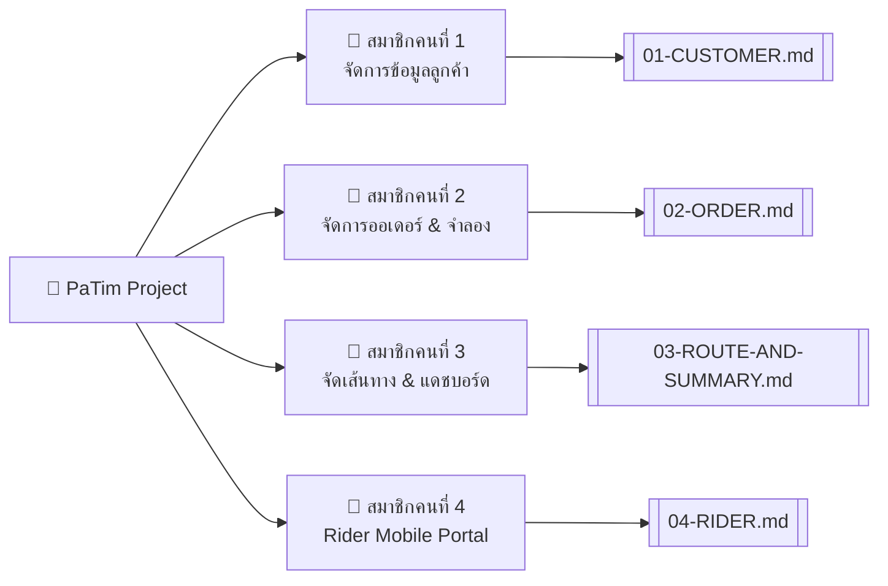

---
tags:
  - project/plan
  - angular
  - advweb
  - vrp-routing
created: 2026-10-04
title: แผนการพัฒนาโปรเจกต์ PaTim (ส่งด่วนมื้อเที่ยง)
---

# 🍱 แผนการพัฒนาโปรเจกต์ PaTim (ฉบับสมบูรณ์)
> [!INFO] **เป้าหมายโครงการ**
> **ระบบจัดเส้นทางและแบ่งงานไรเดอร์อัจฉริยะ (ส่งด่วนมื้อเที่ยง)**  
> บริเวณมหาวิทยาลัยมหาสารคาม (รัศมีไม่เกิน 3 กิโลเมตร)  
> โครงสร้างฐานข้อมูลอ้างอิงตรงตาม **ER Diagram** (5 ตาราง: `customers`, `riders`, `orders`, `delivery_routes`, `route_stops`)

---

## 📌 1. สรุปโจทย์และเงื่อนไขทางธุรกิจ (Business Rules)

> [!WARNING] **เงื่อนไขเหล็ก (Hard Constraints)**
> 1. **เวลาจัดส่ง:** เริ่มออกเดินทาง **11:30 น.** – สิ้นสุดไม่เกิน **12:30 น.** (`time_delivery` $\le 60$ นาที) หากส่งเลททางร้านต้องจ่ายค่าชดเชย 20 บาท/ออเดอร์
> 2. **ความจุรถมอเตอร์ไซค์:** บรรทุกได้สูงสุด **ไม่เกิน 10 กล่อง / คัน** (`total_boxes` $\le 10$)
> 3. **ขีดจำกัดต่อไรเดอร์:** รับงานได้ **ไม่เกิน 3 ออเดอร์ (3 จุดส่ง) / คน / รอบ** (`total_orders` $\le 3$)
> 4. **ความเร็วเฉลี่ยไรเดอร์:** คำนวณที่ $30\text{ กม./ชม.}$ (1 กม. ใช้เวลา $\approx 2$ นาที)
> 5. **พฤติกรรมคำสั่งซื้อ:** ออเดอร์ละ **1–3 กล่อง** (`boxes` 1–3) เข้ามาช่วง 10:00 น. รวม 20–30 รายการต่อวัน

### 📍 พิกัดร้านค้าอ้างอิง (Shop Reference)
- **ชื่อร้าน:** ร้านป้าติ๋ม ข้าวกล่องเดลิเวอรี (ส่งด่วนมื้อเที่ยง)
- **ที่ตั้ง:** คณะวิทยาการสารสนเทศ มหาวิทยาลัยมหาสารคาม
- **เบอร์โทร:** `081-795-8189`
- **พิกัด GPS:** `Latitude: 16.246839`, `Longitude: 103.251963`

### 💰 โมเดลการเงินและสูตรคำนวณ (Financial Model)
- **ราคาขาย:** 65 บาท / กล่อง
- **ต้นทุนอาหาร:** 40 บาท / กล่อง
- **กำไรขั้นต้น:** $65 - 40 = 25$ บาท / กล่อง
- **ค่าบริการไรเดอร์ต่อรอบ (`delivery_price`):**
  - ค่าเรียกรถขั้นต่ำ: **15 บาท / ครั้ง / ไรเดอร์ 1 คน**
  - ค่าระยะทางขนส่ง: **2 บาท / กิโลเมตร / กล่อง**

$$
\text{delivery\_price} = 15 + (\text{total\_distance} \times 2 \times \text{total\_boxes})
$$

$$
\text{net\_profit} = (\text{total\_boxes} \times 25) - \text{delivery\_price}
$$

---

## 🗺️ 2. ตารางการแบ่งงานสมาชิก 4 คน (Team Assignment)



| สมาชิก | หน้าที่รับผิดชอบ | Component / Page | ตารางใน DB ที่ใช้ | API Endpoints | Data Model | คู่มือเฉพาะบุคคล |
|:---|:---|:---|:---|:---|:---|:---|
| **คนที่ 1** | **จัดการข้อมูลลูกค้า (Customer Management)** | `pages/customer-management`<br>ปักหมุด Leaflet Map, ค้นหาชื่อ/ID, กรอง 1.0 กม., คลิกเลือกพิกัด Lat/Lng | `customers` | `GET/POST/PUT/PATCH/DELETE /customers`<br>`GET /customers/near?km=1.0`<br>`GET /customers/search` | `Customer`<br>`CreateCustomerDto` | [[01-CUSTOMER\|01-CUSTOMER.md]] |
| **คนที่ 2** | **จัดการออเดอร์ & จำลอง (Order Management)** | `pages/order-management`<br>ฟอร์ม 1–3 กล่อง, จำลอง 20–30 ออเดอร์ (10:00 น.), ล้างออเดอร์ทั้งหมด, กรอง 2.0 กม., KPI Cards | `orders`<br>`customers` | `GET/POST/PUT/PATCH/DELETE /orders`<br>`GET /orders/near?km=2.0`<br>`GET /orders/search`<br>`POST /orders/simulate`<br>`DELETE /orders/all` | `Order`<br>`CreateOrderDto`<br>`OrderStatus` | [[02-ORDER\|02-ORDER.md]] |
| **คนที่ 3** | **จัดเส้นทาง & แดชบอร์ดสรุป (Route & Dashboard)** | `pages/route-dashboard`<br>ปุ่มจัดเส้นทาง 1 คลิก, เส้นทางแยกสีบน Leaflet Map, Re-calculate, แดชบอร์ดกำไร Real-time | `delivery_routes`<br>`riders`<br>`orders` | `GET /orders?status=pending`<br>`GET /riders`<br>`GET/POST /delivery-routes` | `DeliveryRoute`<br>`RouteStop`<br>`DispatchSummary` | [[03-ROUTE-AND-SUMMARY\|03-ROUTE-AND-SUMMARY.md]] |
| **คนที่ 4** | **หน้าไรเดอร์มือถือ (Rider Mobile Portal)** | `pages/rider-portal`<br>Mobile-First, ค้นหา Job Code, สรุปกล่องรวม ($\le 10$), ลำดับจุดส่ง 1->2->3, เปิด Google Maps นำทาง, บันทึกส่งสำเร็จ | `delivery_routes`<br>`route_stops`<br>`orders` | `GET /delivery-routes/:jobCode`<br>`PATCH /delivery-routes/:jobCode/stops/:stopId` | `RiderJobBatch`<br>`RiderStopItem`<br>`StopDeliveryStatus` | [[04-RIDER\|04-RIDER.md]] |

---

## 💻 3. โครงสร้างโปรเจกต์ (Project Structure)

```text
pa_tim/
├── Plan/                               # เอกสารคู่มือและการออกแบบระบบ
│   ├── PROJECT_PLAN.md                 # แผนแม่บทโครงการ
│   ├── DATABASE_SCHEMA.md              # โครงสร้างฐานข้อมูลอ้างอิงตาม ER Diagram
│   ├── API_DOCUMENTATION.md            # รายละเอียด REST API ทุก Endpoint
│   ├── 01-CUSTOMER.md                  # สมาชิกคนที่ 1: จัดการลูกค้า & แผนที่
│   ├── 02-ORDER.md                     # สมาชิกคนที่ 2: จัดการออเดอร์ & Simulation
│   ├── 03-ROUTE-AND-SUMMARY.md         # สมาชิกคนที่ 3: จัดเส้นทาง & แดชบอร์ด
│   ├── 04-RIDER.md                     # สมาชิกคนที่ 4: Rider Mobile Portal
│   └── 05-LEAFLET-GUIDE.md             # คู่มือการใช้งานแผนที่ Leaflet ใน Angular
├── src/                                # Frontend Angular 22
│   ├── app/
│   │   ├── models/                     # Data Models (TypeScript Interfaces)
│   │   │   ├── customer.model.ts       # โมเดลข้อมูลลูกค้า (customers)
│   │   │   ├── order.model.ts          # โมเดลข้อมูลออเดอร์ (orders)
│   │   │   ├── route.model.ts          # โมเดลข้อมูลเส้นทาง (delivery_routes, route_stops)
│   │   │   └── rider-job.model.ts      # โมเดลข้อมูลใบงานไรเดอร์ (delivery_routes, route_stops)
│   │   ├── services/                   # HttpClient Services
│   │   │   ├── customer.service.ts     # Service จัดการลูกค้า
│   │   │   ├── order.service.ts        # Service จัดการออเดอร์ & Simulate
│   │   │   ├── route-calculator.service.ts # Service คำนวณ VRP Routing & กำไร
│   │   │   ├── delivery-route.service.ts   # Service บันทึก/ดึงรอบจัดส่ง
│   │   │   └── rider.service.ts        # Service ใบงานไรเดอร์ & อัปเดตสถานะ
│   │   ├── pages/                      # หน้าจอของสมาชิกทั้ง 4 คน
│   │   │   ├── customer-management/    # หน้า 1: จัดการลูกค้า
│   │   │   ├── order-management/       # หน้า 2: จัดการออเดอร์
│   │   │   ├── route-dashboard/        # หน้า 3: จัดเส้นทาง & แดชบอร์ด
│   │   │   └── rider-portal/           # หน้า 4: ไรเดอร์บนมือถือ
│   │   ├── app.config.ts               # provideHttpClient(), provideRouter()
│   │   └── app.routes.ts               # การกำหนดเส้นทางหน้าจอ
│   ├── environments/
│   │   └── environment.ts              # apiUrl และ shopLocation
│   └── styles.css                      # TailwindCSS & Leaflet CSS
```

---

## 📚 4. ลิงก์เอกสารอ้างอิงและคู่มือประจำแต่ละส่วน
- 📖 [[01-CUSTOMER|คู่มือสมาชิกคนที่ 1: ระบบจัดการข้อมูลลูกค้าและแผนที่]]
- 📖 [[02-ORDER|คู่มือสมาชิกคนที่ 2: ระบบจัดการออเดอร์และการจำลองข้อมูล]]
- 📖 [[03-ROUTE-AND-SUMMARY|คู่มือสมาชิกคนที่ 3: ระบบจัดเส้นทางและแดชบอร์ดสรุปยอด]]
- 📖 [[04-RIDER|คู่มือสมาชิกคนที่ 4: ระบบไรเดอร์ Mobile Portal]]
- 📖 [[05-LEAFLET-GUIDE|คู่มือการใช้งานแผนที่ Leaflet ใน Angular]]
- 🗄️ [[DATABASE_SCHEMA|โครงสร้างฐานข้อมูลอ้างอิงตาม ER Diagram]]
- 📖 [[API_DOCUMENTATION|เอกสาร REST API ฉบับสมบูรณ์]]
